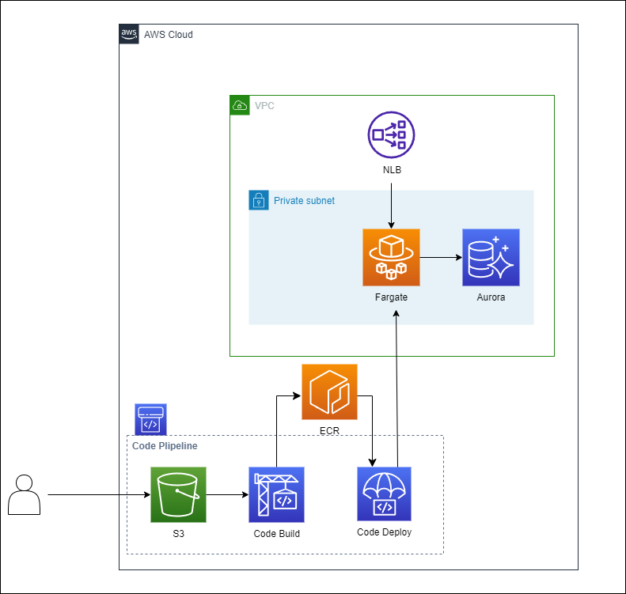

## 概要
AmazonECSクラスター環境、AWSCodeシリーズを使用したCI/CD環境を構築するCloudFormationサンプルです。
VPC、Auroraスナップショット、コンテナイメージを指定し実行することで、指定のVPC環境に既存のAmazonECS環境を複製できます。

## 構成

## 自動で作成されるリソース
#### Sample_CF_Aurora.yaml
- Aurora
  - AuroraDBクラスター
  - AuroraDBインスタンス

#### Sample_CF_ECS_CICD.yaml
- ネットワーク
  - Network Load Balancer
  - TargetGroup(Blue)
  - TargetGroup(Green)
  - Listener(Blue)
  - Listener(Green)
- タスク定義
  - コンテナ用LogGroup
  - タスク実行ロール
  - タスク定義
- ECSクラスター
  - ECSクラスター
  - ECSサービス
- CI/CD用 IAM Role, Policy
  - CodeBuild IAM Role
  - CodeBuild IAM Policy
  - CodeDeploy IAM Role
  - CodeDeploy IAM Policy
- カスタムリソースLambda用 IAM Role, Policy
  - Lambda IAM Role
  - Lambda IAM Policy
- Blue Green Artifact S3バケット
  - S3バケット
- Code Build
  - CodeBuild用LogGroup
  - CodeBuild
- Code Deploy
  - アプリケーション
  - デプロイグループ

## 実行時に必要なパラメータ
#### Sample_CF_Aurora.yaml
- Auroraクラスター名
- Auroraインスタンス名
- Auroraクラスタースナップショット名
- インスタンスクラス
- サブネットグループ名
- セキュリティグループ

#### Sample_CF_ECS_CICD.yaml
- NLB サブネット
- ターゲットグループ VPC ID
- ECSサービス作成時に指定するコンテナイメージ
- ECSサービス セキュリティグループ
- ECSサービス サブネット
- CodePipeline Sorce S3バケット名
- CodePipeline Sorce S3オブジェクトキー

## 実行時に必要なリソース
#### Sample_CF_Aurora.yaml
- Auroraクラスタースナップショット
- サブネットグループ
- セキュリティグループ

#### Sample_CF_ECS_CICD.yaml
- VPC/サブネット
- ECR コンテナイメージ
- ECS用 セキュリティグループ
- CodePipeline Sorce S3バケット
- CodePipeline Sorce オブジェクト
- Systems Manager パラメータストア